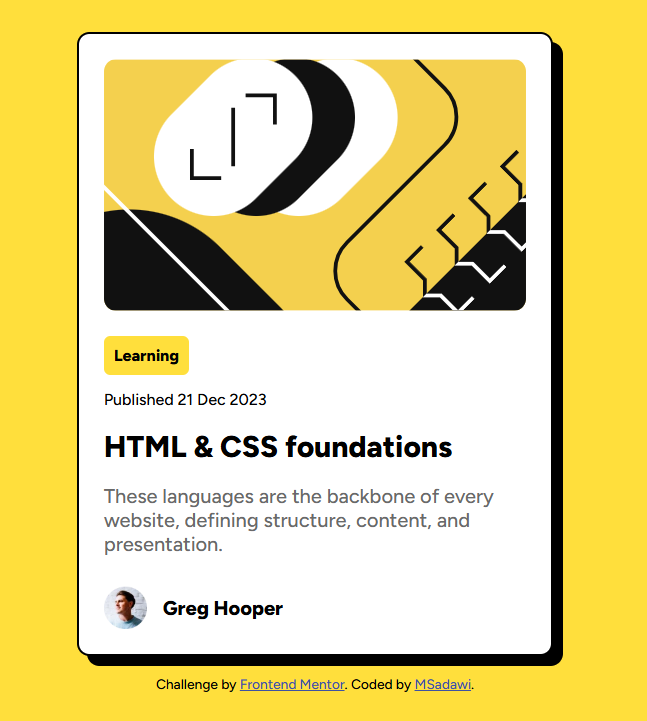

# Frontend Mentor - Blog preview card solution

This is a solution to the [Blog preview card challenge on Frontend Mentor](https://www.frontendmentor.io/challenges/blog-preview-card-ckPaj01IcS). Frontend Mentor challenges help you improve your coding skills by building realistic projects. 

## Table of contents

- [Overview](#overview)
  - [The challenge](#the-challenge)
  - [Screenshot](#screenshot)
  - [Links](#links)
- [My process](#my-process)
  - [Built with](#built-with)
  - [What I learned](#what-i-learned)
- [Author](#author)

## Overview

### The challenge

Users should be able to:

- See hover and focus states for all interactive elements on the page

### Screenshot

### Links

- Solution URL: [Add solution URL here](https://www.frontendmentor.io/solutions/responsive-blog-preview-card-using-css-flexbox-and-media-query-yw7Q8XNkEO)
- Live Site URL: [Add live site URL here](https://msadawi1.github.io/Responsive-blog-preview-card-using-CSS-Flexbox-Media-Query/)

## My process

### Built with

- HTML5
- CSS selectors
- Flexbox

### What I learned

- This is my first time building a responsive component using Meida Query, I made 3 breakpoints so it can look better on smaller screens. 

## Author

- Frontend Mentor - [@msadawi1](https://www.frontendmentor.io/profile/msadawi1)
- Twitter - [@msadawi0](https://www.twitter.com/msadawi0)